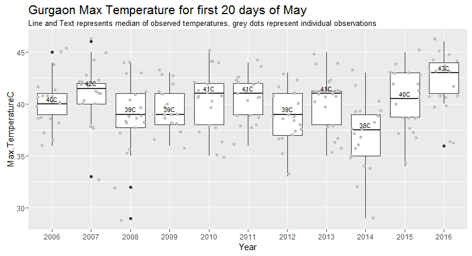
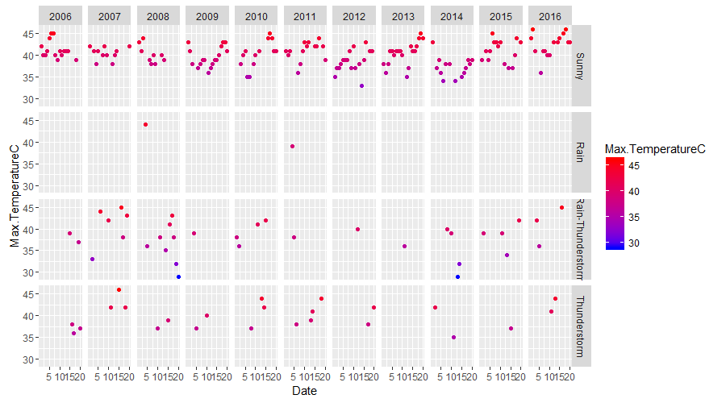

# Does Gurgaon feel hotter than usual?

## What I wanted to know
It's the 20th of May 2016, and Gurgaon is a furnace. It felt hotter than usual, and corroboration would have been nice. So to quantify this feeling we look at the maximum temperature for Gurgaon over the past 10 years. This [script](gurgaonWeather.r) was used to create the following plots.
### What do we see
  
It does look to me like that 2016 has seen more hotter days than over the past few years. A small shift in median temperature can make things feel substantially different.
#### Weather type and temperature range
 
The weather around this time of the year seems to be driven to extremes. They are either very hot, or involve an element of thunderstorm.
## Aims of this project
Since I was anyway trying to learn R, and found the Coursera course on [Reproducibility](https://www.coursera.org/learn/reproducible-research) highly enjoyable. I will try to showcase the steps taken to reach our above plot outputs. The steps involved are:  
1. Fetch data  
2. Manipulate data  
3. Plot data  

## Libraries
The script uses the following libraries by [Hadley](https://github.com/hadley)  
* [*dplyr*](https://github.com/hadley/dplyr) - data manipulation  
* [*lubridate*](https://github.com/hadley/lubridate) - date manipulation  
* [*ggplot2*](https://github.com/hadley/ggplot2) - plot making
 
The script uses the dev branch of ggplot2 from Github, branch [*b181e9a*](https://github.com/hadley/ggplot2) since we use the sub title feature which isn't present in the CRAN version as of May 2016. The code to install this particular library version is:

    # install.packages("devtools")
    devtools::install_github("hadley/ggplot2")
    
## Data Fetching
### Source URL Construction
The weather data is fetched from Wunderground, who helpfully provide a url which gives us a csv dump. I got the url by looking at the Wunderground page for a [location](https://www.wunderground.com/in/gurgaon) and then clicking on the [History](https://www.wunderground.com/history/airport/VIDP/2016/05/20/DailyHistory.html?req_city=Gurgaon&req_statename=India&reqdb.zip=00000&reqdb.magic=1&reqdb.wmo=42178) tab.  At the bottom of which is a link to a csv file. Looking at the url we see that some key information is encoded in it.

    https://www.wunderground.com/history/airport/VIDP/2016/5/19/MonthlyHistory.html?req_city=Gurgaon&req_statename=India&reqdb.zip=00000&reqdb.magic=1&reqdb.wmo=42178&format=1

The script starts by taking the above url apart and putting it together by contructing a date sequence. For instance you can change the ```yearRange``` variable and set the initial year and final year to get data for all the years between and including them.  

### Fetch Data from Wunderground
We loop through the ```yearRange``` and get the weather data for all the days in month of ```mDate``` for the given range of years.  Changing the date in ```dDate``` doesn't seem to affect the output result. 

    ## create a base path to create final data url
      basePath <- c("https://www.wunderground.com/history/airport/VIDP/","/","/","/MonthlyHistory.html?req_city=Gurgaon&req_statename=India&reqdb.zip=00000&reqdb.magic=1&reqdb.wmo=42178&format=1")  
    
    ## set month and date
      mDate <- "05"
      dDate <- "01"
      
    ## set year range
      yearRange <- c(2006,2016)

Then do a loop between the ```yearRange``` and fetch the data.

     ## make a loop and fetch data for the year range mentioned for the entire month
      for (i in yearRange[1]:yearRange[2]) {
       filePath <- paste0(basePath[1],as.character(i),basePath[2],mDate,basePath[3],dDate,basePath[4])
        print(filePath)
        tmp <- read.csv(filePath)
        if(i == yearRange[1]){
          df1 <- tmp
        }else{
         df1 <- rbind(df1,tmp)
        }
      }

And since today is the 20th, I filter out data for dates 1-20 from past years too. 
```r
## filter out dates
df2 <- df1 %>% filter(Date < 21)
```
Then we calculate the median MaxTemperature for for each with the help of the *dplyr* package.  

    ## calculate the median  
    df3 <- df2 %>% select(Year,Max.TemperatureC) %>% group_by(Year) %>% summarise(medTemp = median(Max.TemperatureC))

## Plotting
Now with the data in shape, we plot the data. Since I wanted to see how the pattern of max daily temperature has varied over the years I decided to visualise it as a box plot and display the median of the observations.

### The Code
    ## do the box plot
     q <- ggplot(df2,aes(Year,Max.TemperatureC))
     q  <- q + geom_boxplot() + geom_jitter(colour="grey75")
    ## add in median to the box plot q
     q <- q + geom_text(data = df3, aes(y = medTemp, label = paste0(round(medTemp,0),"C")),size = 3, vjust = -0.5)
     q <- q + ggtitle("Gurgaon Max Temperature for first 20 days of May",subtitle="Line and Text represents median of observed temperatures, grey dots represent individual observations")
     q + theme(plot.title = element_text(hjust=0, size=16))  

## Next Steps
Probably put these in a function and make it more customisable. 
Inputs: Time Range, Locations etc  

### Next Next Steps
Make a Shiny App.

## Note
Please be gentle while hitting the Wunderground server. Looking at weather data options would be an important next steps. 
